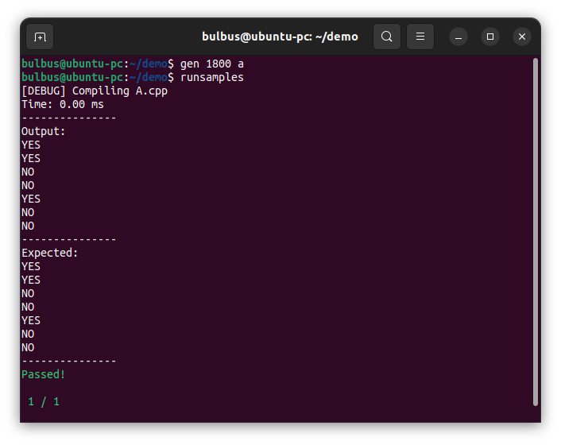

# Judger
Automatically grades your C++ codeforces solution against the sample test cases for Unix systems

---

## Installation
Clone the repository and store it wherever you want on your computer.
Run `pip install -r requirements.txt` to install the dependencies ("BeautifulSoup" and "requests" for fetching the test cases)

It is *recommended* to add the directory to PATH and save aliases in your .bashrc for easier use but it is not necessary.

PATH example:
`export PATH="/path/to/directory:$PATH"`

Alias example (in your .bashrc):
`alias run="python3 /path/to/directory/runner.py"` and `alias gen="python3 /path/to/directory/gen.py"`
for easier usage

## Usage

`$ gen [Contest id] [Problem id]`

Run gen.py with the command-line arguments:
- Contest id (**NOT** the round number but usually found in the URL)
- Problem id (usually the letter)

It is necessary to run gen.py BEFORE runner.py since it fetches the sample cases.

Your solution **MUST** be named `"Problem id".cpp`

After running **gen.py**, run **runner.py** to grade your solution.

**NOTE:** **runner.py** will always run your solution against the most recent fetched problem
